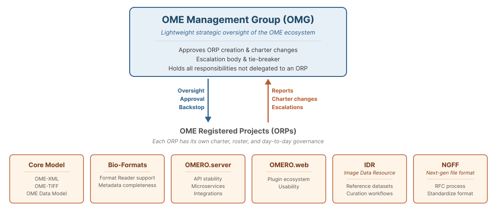

# OME Governance

This repository contains the governance documents, policies, agreements,
charters, and rosters that support the operation of the OME community.

The official governance website is available at:

https://www.openmicroscopy.org/governance/

The website and this repository contain the same governance materials,
presented in different formats. Repository history provides the authoritative
record of governance changes.

## Core OME Governance

- [Governance Charter](charter/)
- [Management Group](management-group/)

## Community Policies

- [Code of Conduct](code-of-conduct/)
- [Participation Agreement](participation-agreement/)

## OME Registered Projects (ORPs)

- [Active ORPs](projects/)
- Proposed ORPs
- Retired ORPs

## Contributing

Governance changes are proposed through pull requests and reviewed by the
appropriate governance body.

- [ORP Charter Template](orp/templates/charter/)
- [ORP Roster Template](orp/templates/roster/)

